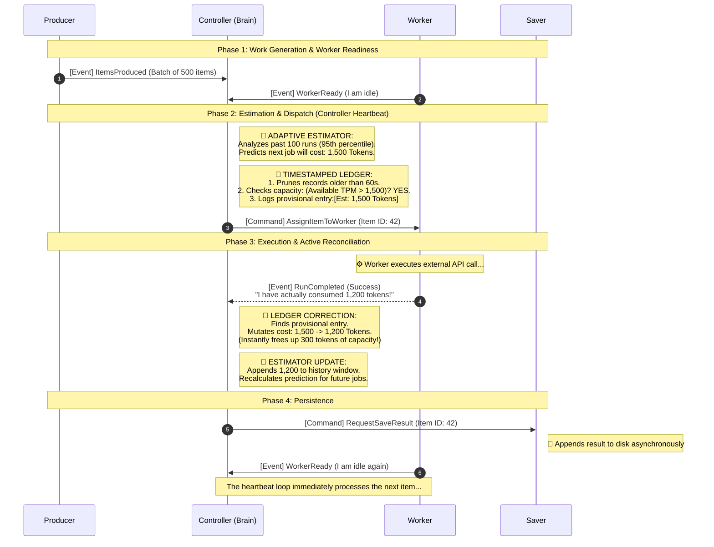

If you have ever worked with third-party APIs, you know the pain of rate limits. One moment your application is flying, and the next, it is slammed with the dreaded `429 Too Many Requests` error. Building a system that respects these limits while maximizing throughput is a classic but surprisingly tricky engineering challenge.

Common approaches often fall short. Simple counters are inaccurate. Token buckets, while better, do not model a true sliding window and can lead to "thundering herd" problems where you exhaust your budget in the first second of a new minute. More complex, decentralized systems with workers managing their own concurrency often descend into a mess of locks, race conditions, and deadlocks.

What if we could build a system that was not just resilient, but intelligent? A system that not only respects limits perfectly but also learns, adapts, and even heals itself when it gets stuck?

Today, I am showcasing a project that does just that. It is a resilient producer-consumer service built in Python with `asyncio`. Its core philosophy is **Active, Centralized Control**: a single "brain" that orchestrates the entire system with the precision of a watchful eye.

### The Philosophy: An Active, Watching Brain

Most concurrent systems are passive. They react to events. A worker finishes a job, an event is fired, and a manager might assign a new one. This works, but it can be fragile. What happens if the system gets into a state where no events are firing, but there is still work to be done? Deadlock.

Our architecture flips this on its head. The entire system is orchestrated by a central **Controller** that runs on a continuous, high-frequency **heartbeat loop** (e.g., every 100ms). It is not waiting; it is always watching.

On each tick of the heartbeat, it executes a simple but powerful formula: `F(event-state) -> ACTIONS`.

*   **`F`**: The Controller's decision logic. This is not just a simple "if-then." It is a strict hierarchy of checks. Are we out of resources? Is all the work done? Is the system stuck? Is there work to do and a worker ready?
*   **`event-state`**: The input. This includes the Controller's complete model of the world (who is busy, how much budget is left) and a queue of recent events (like "Worker 5 just finished a job").
*   **`ACTIONS`**: A series of direct, unambiguous commands dispatched to other components, like "Worker 5, process this specific item."

This active model means the Controller sees opportunities the moment they arise. A rate-limit slot from 59 seconds ago just expired? The Controller sees it on the next tick and can dispatch new work instantly.

### The Architecture: A Clear Separation of Brain and Brawn

The system is split into two planes. The Control Plane is the brain, and the Data Plane is the brawn.



The components in the Data Plane are "dumb." They follow orders and report facts. The Producer reads data and yields batches. The Worker wakes up, announces it is ready, and waits for a command. It manages no state, no locks, and no limits. All intelligence resides in the Controller. This radical centralization makes the overall system state perfectly predictable.

### Deep Dive 1: The Timestamped Ledger

To manage a strict "Tokens Per Minute" (TPM) limit, we do not use a leaky bucket or a naive counter. We use a **Timestamped Ledger**, which is an advanced evolution of the Sliding Window Log algorithm.

#### The "Restaurant Fire Code" Analogy
Imagine you are managing a restaurant with a strict fire code capacity of 100 people. This is your rate limit. 

A standard counter is like a bouncer with a clicker. He clicks when people enter and deducts when they leave. But in an API, "leaving" is just time passing. A leaky bucket assumes people leave at a constant mathematical rate, which is rarely true.

Our Ledger is like a bouncer with a highly detailed logbook. 
When a group arrives, he writes down their exact entry time and the number of people in the party. To know the current capacity, he looks at the book, crosses out anyone who arrived more than 60 minutes ago, and sums up the remaining guests. This gives a mathematically perfect picture of the exact occupancy at any given millisecond.

#### The Technical Implementation
In code, this is a `deque` (a double-ended queue) of `LedgerEntry` objects. Each entry holds a `run_id`, a `timestamp`, and the `tokens_per_run`. 

When the Controller wants to dispatch a job, it performs three steps:
1.  **Prune**: It iterates from the oldest end of the `deque` and removes any entry older than 60 seconds.
2.  **Calculate**: It sums the `tokens_per_run` of all remaining entries.
3.  **Decide**: If `(Total Allowed TPM) - (Sum of Ledger) >= (Cost of New Job)`, the job is approved.

#### The "Correction" Superpower
Here is where our system goes beyond a standard Sliding Window Log. When we dispatch a job, we only have an *estimate* of its token cost. We add this estimate to the ledger. 

However, APIs have variable costs depending on the payload. When the Worker finishes the job, it reports the *actual* tokens consumed. The Controller then reaches back into the Ledger, finds the exact entry by its `run_id`, and mutates the `tokens_per_run` from the estimate to the actual cost.

```text
CURRENT LEDGER STATE (60-second window):[Now - 55s] ID: a1b2 | Est: 1500 | Actual: 1200  (Corrected!)
[Now - 40s] ID: c3d4 | Est: 1500 | Actual: 1800  (Corrected!)[Now - 05s] ID: e5f6 | Est: 1500 | Actual: ????  (In-flight, holding estimated space)
```

This prevents "capacity leaks" where over-estimation would permanently starve the system of resources for the rest of the minute. It is perfect, self-healing accounting.

### Deep Dive 2: Adaptive Estimation

The Ledger's accuracy depends entirely on having a good *initial estimate* before a job is dispatched. If you estimate 1,000 tokens but jobs actually cost 5,000, you will blow past your API limits. If you estimate 10,000 tokens but they only cost 1,000, you will process data at 10% of your maximum speed.

How do we predict the future cost of an API call? We use **Adaptive Estimation**.

#### The "Morning Commute" Analogy
Imagine trying to predict how long your drive to work will take. You do not just guess a static number forever. You base it on recent experience. 

If your last five commutes took 25, 27, 26, 25, and 28 minutes, predicting 26 minutes for tomorrow is a solid bet. This is a **Moving Average**. 

But what if your history looks like 25, 26, 25, 120 (due to a massive car crash), and 25? If you use the average, your prediction gets skewed to 44 minutes. You will leave for work way too early for weeks. Instead, you could use the **95th Percentile**. This mathematical approach ignores freak outliers and tells you the safest, most reliable number for the vast majority of days.

#### The Technical Implementation
Our Controller maintains a `tpr_history` (Tokens Per Run History) `deque` that stores the exact, actual cost of the last 100 successful runs. 

Before dispatching the next item, the Controller looks at this history to generate a `RunCostEstimate`. We configure the system to use the Percentile strategy:

1.  It sorts the history array of the last 100 costs.
2.  It picks the value at the 95th index (or whatever percentile we configure in `settings.yaml`). 
3.  This value becomes the initial estimate fed into the Timestamped Ledger for the next job.

As long as the API payload complexity gradually shifts, our system smoothly "rides the curve," keeping the estimates aggressively tight without ever violating the limits.

### Resilience in Action: The Self-Healing Loop

Here is where the active control model and adaptive estimation come together to create magic. 

Imagine our system has learned that jobs cost around 1,500 tokens. Suddenly, the dataset changes, and the true cost jumps to 2,500. However, the system currently only has 2,000 tokens of available space in the minute window.

*   **A passive system** would die right here. It thinks jobs cost 1,500, but they are failing or getting rejected. Or worse, the Controller refuses to dispatch because the newly required 2,500 tokens do not fit, but because it never dispatches, it never gets a new completed job to learn from. The system is deadlocked.
*   **Our active Controller** detects this. On every heartbeat, it notices a dangerous condition. Work exists, workers are idle, but nothing has been dispatched for 30 seconds. This is **stagnation**.

The Controller immediately enters **Recovery Mode**. It ignores its own learned estimate (which is currently causing the deadlock) and dispatches a single "probe" job using a safe, pre-configured fallback estimate. 

This job will process. When it finishes, it returns the new, true cost of 2,500 tokens. This fresh, accurate data point is pushed into the `tpr_history`. The system recalculates its estimations, realizes the new reality, and safely resumes processing. The deadlock is broken automatically.

### The Road Ahead

No design is perfect, and building on a solid foundation means being honest about the next steps. Here is what is next for hardening this system for true production scale:

1.  **Taming Memory with Backpressure**: Currently, the Producer can create items much faster than the rate-limited Workers can process them, causing the Controller's pending work queue to grow indefinitely. For massive datasets, this can lead to an out-of-memory crash. We need to convert the pending queue to a bounded `asyncio.Queue`, which will force the Producer to asynchronously pause when the queue is full.
2.  **Periodic Checkpointing**: The system saves its state on graceful shutdown, but a hard hardware crash would lose all progress from the current session. We plan to trigger periodic checkpoint commands via the Controller's `MonitorTick` event to persist snapshots every few minutes.
3.  **Streaming Data Loading**: The current Producer loads the entire dataset into memory at startup. We must evolve it to stream data from a file or database cursor to support terabyte-scale processing.

### Conclusion

By shifting from a passive, reactive model to an active, centralized one, we can build concurrent systems that are vastly more resilient and efficient. The combination of an "always-watching" Controller, the flawless accounting of a Timestamped Ledger, and the self-correcting intelligence of Adaptive Estimation creates a powerful engine. It allows the system to push performance exactly to the redline, and intelligently recover when the environment changes.